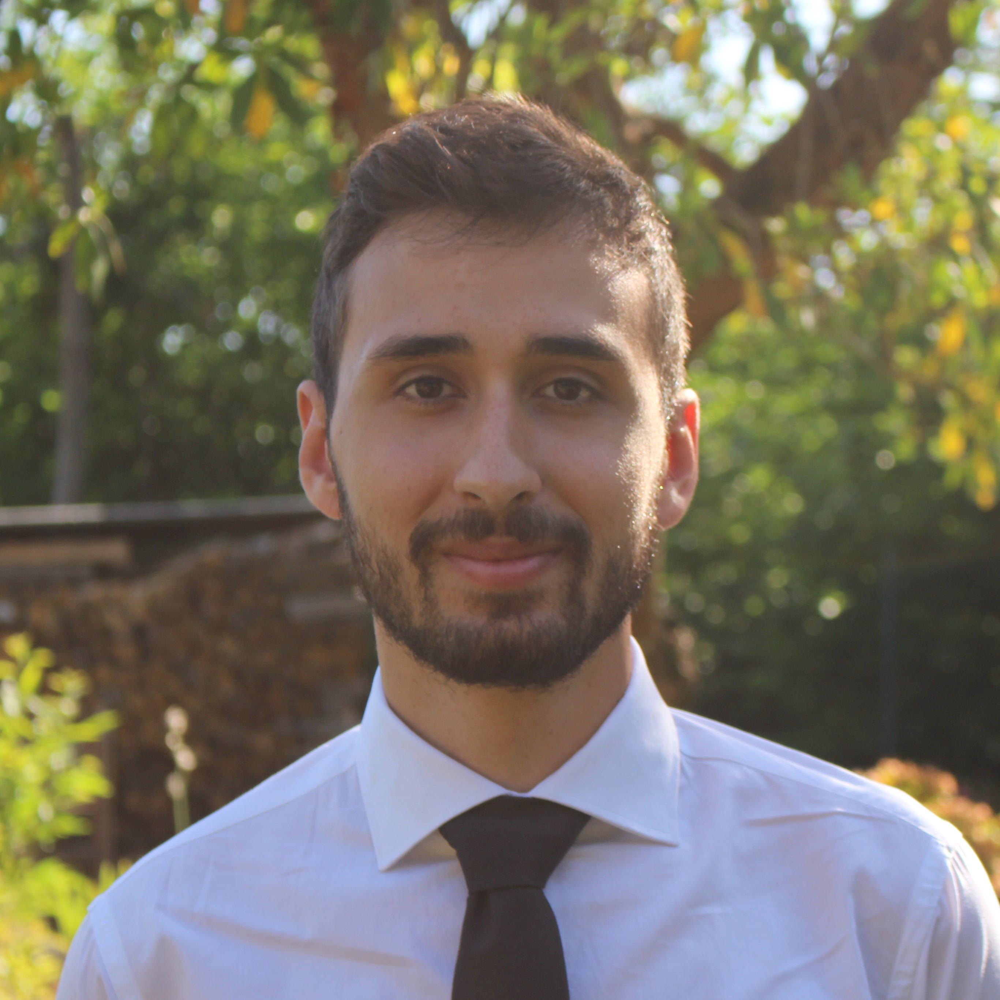

I'm a 2nd year Ph.D. student in **Operations Research and Financial Engineering (ORFE)** at **Princeton University**.  
My work lies at the intersection of *probabilistic machine learning* and *non-convex optimization*.  
I am fortunate to be advised by prof. [Boris Hanin](https://boris-hanin.github.io/).

Before my Ph.D. I obtained a Master degree in Mathematics (track Stochastics and Data Science) from University of Turin and I was a Senior Allievo at Collegio Carlo Alberto.  
I used to have a strong focus on Probability Theory and my research has deepened *Bayesian neural networks* and their infinite-width prior and posterior limits. I was fortunate to work with prof. [Stefano Favaro](https://sites.carloalberto.org/favaro/) and prof. [Dario Trevisan](https://web.dm.unipi.it/trevisan/en/).  
I got my Bachelor in Mathematics (track Computational Math) from University of Pisa, with a [thesis](https://github.com/caporali/bsc_thesis/blob/main/thesis.pdf) on *universality of neural networks*.

- e-mail: `fc4978 [at] princeton.edu`
- GitHub: [caporali](https://github.com/caporali)
- [LinkedIn](https://www.linkedin.com/in/francescocaporali/) 

## News
- Jul. 2025: Attending *COLT 2025 (Lyon)* to present a poster at the *TASC Workshop*.
- Jun. 2025: Working on stability and implicit bias of GD/SGD and designing principled noise, clipping, and step-size schedules for
reliable training.

## Publications / Preprints
1. *F. Caporali*, S. Favaro, D. Trevisan, 
	[Student-$t$ processes as infinite-width limits of posterior Bayesian NNs](https://openreview.net/pdf?id=iUppQcPAMK),
	In: *TASC workshop, COLT 2025*

## Teaching
Tutorial Instructor, *University of Turin*:  
- *Probability and Statistics*, B.Sc. Mathematics for Finance and Insurance (Mar.-Jun. 2023).

Teaching Assistant (TA), *Princeton University*:  
- *Probability Theory (ORF526)* (Sep.-Dec. 2025);
- *Probability and Stochastic Systems (MAT380/ORF309/EGR309)* (Jan.-May. 2026).