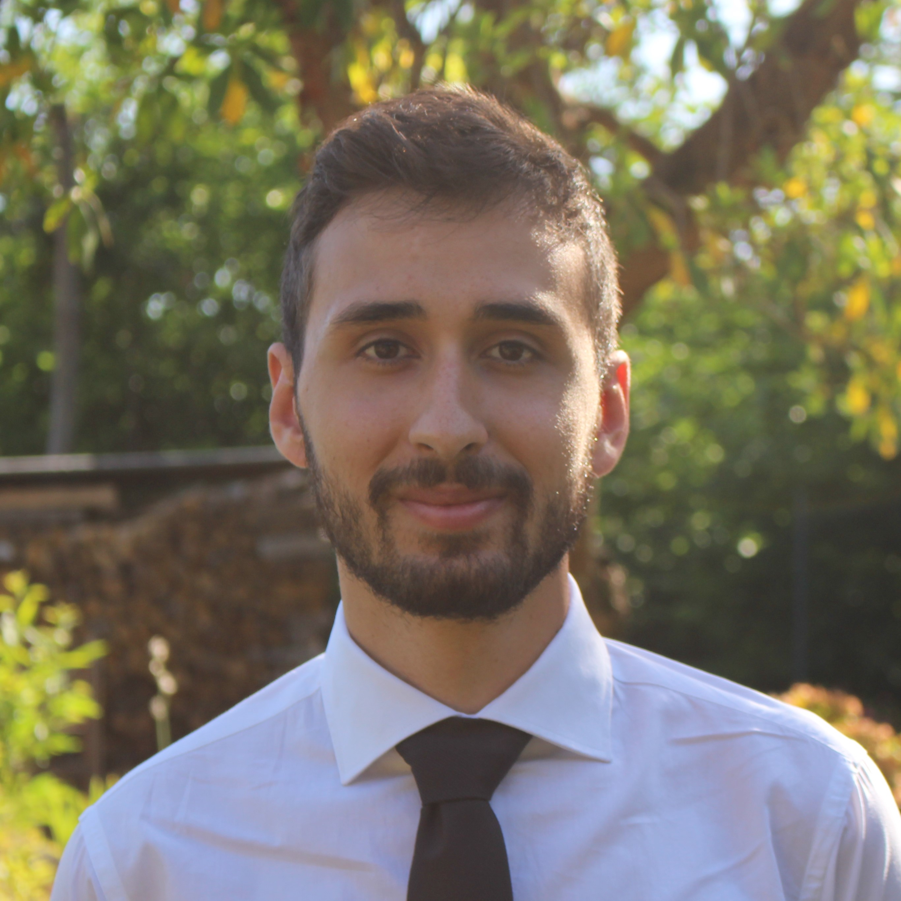

I'm a 2nd year Ph.D. student in **Operations Research and Financial Engineering (ORFE)** at **Princeton University**.  
My work lies at the intersection of *probabilistic machine learning* and *non-convex optimization*.  
I am fortunate to be advised by [Prof. Boris Hanin](https://boris-hanin.github.io/).

Before my Ph.D., I obtained a Master's degree in Mathematics (track: Stochastics and Data Science) from the University of Turin, and I was a Senior Allievo at Collegio Carlo Alberto.  
My earlier work focused on Probability Theory and explored *Bayesian neural networks* and their infinite-width prior and posterior limits. I was fortunate to work with [Prof. Stefano Favaro](https://sites.carloalberto.org/favaro/) and [Prof. Dario Trevisan](https://web.dm.unipi.it/trevisan/en/).  
I obtained my Bachelor's degree in Mathematics (track: Computational Math) from the University of Pisa, with a [thesis](https://github.com/caporali/bsc_thesis/blob/main/thesis.pdf) on the *universality of neural networks*.

-  e-mail:  
	`fc4978 [at] princeton.edu`
-  github:  
	[caporali](https://github.com/caporali)
-  linkedin:  
	[francescocaporali](https://www.linkedin.com/in/francescocaporali/) 

## News
- Attended *COLT 2025 (Lyon)* to present a poster at the *TASC Workshop*.
{: date = "Jul. 2025:"}
- Working on the stability and implicit bias of step-size schedulers for GD, and studying principled first-order methods for convergence to flat configurations of neural networks.
{: date = "Jun. 2025-Jun. 2026:"}
- I will intern as an Applied Scientist at AWS AI Labs.
{: date = "Jun. 2026-Aug. 2026:"}
{: .news}

## Publications / Preprints
1. *F. Caporali*, S. Favaro, D. Trevisan, 
	[Student-$t$ processes as infinite-width limits of posterior Bayesian NNs](https://openreview.net/pdf?id=iUppQcPAMK),
	In: *TASC Workshop, COLT 2025*

## Teaching
Tutorial Instructor, *University of Turin*:
- *Probability and Statistics*, B.Sc. Mathematics for Finance and Insurance (Mar.-Jun. 2023).

Teaching Assistant (TA), *Princeton University*:
- *Probability Theory (ORF526)* (Sep.-Dec. 2025);
- *Probability and Stochastic Systems (MAT380/ORF309/EGR309)* (Jan.-May. 2026).
